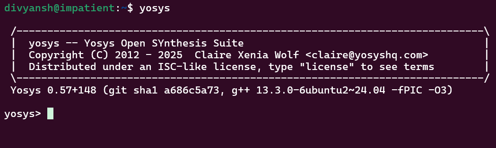
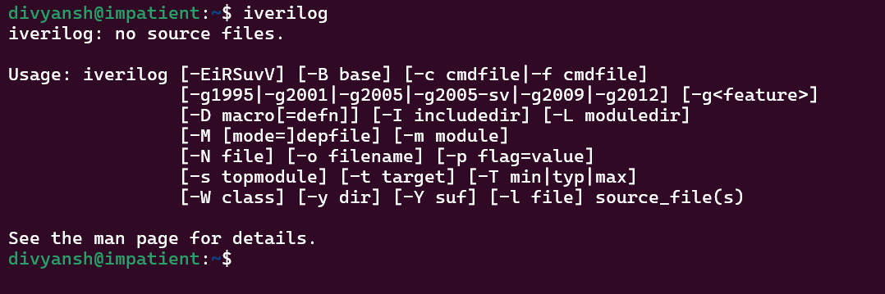
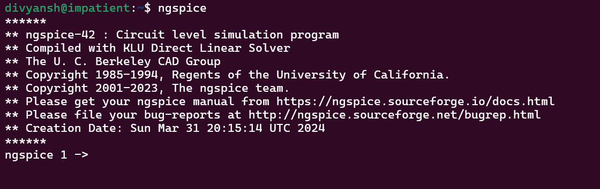

# 🖥️ RISC-V SoC Tapeout Program VSD

<div align="center">


</div>

Welcome to my journey through the **RISC-V SoC Tapeout Program (VSD)**!  

This repository documents my **Week 0 progress**, including GitHub setup, tool installations, and verification proofs.

<div align="center">

> *"Hands-on journey from RTL design to tapeout using open-source EDA tools while contributing to India’s RISC-V ecosystem."*

</div>

<div align="center">

```

📝 RTL Design → 🔄 Synthesis → 📊 Simulation → ⚡ Verification

```

</div>

---

## 📅 Week 0 — Overview

This week focuses on:

 **Task:** Installing and verifying core EDA tools for RTL design and simulation.

---


</details>

<details>
<summary><b>🛠️ Task: Tool Installation</b></summary>

**System Requirements:**

| Parameter | Requirement       |
| --------- | ----------------- |
| RAM       | 6 GB              |
| HDD       | 50 GB             |
| OS        | Ubuntu 20.04+     |
| CPU       | 4 vCPU            |
| VM        | Oracle VirtualBox |

---

### 📦 Tools Installed

| Tool            | Purpose                            | Verification |
| --------------- | ---------------------------------- | ------------ |
| 🧠 **Yosys**    | RTL Synthesis & Logic Optimization | ✅ Verified   |
| 📟 **Iverilog** | Verilog Simulation & Compilation   | ✅ Verified   |
| 📊 **GTKWave**  | Waveform Viewer & Analysis         | ✅ Verified   |
| ⚡ **Ngspice**   | Analog & Mixed-Signal Simulation   | ✅ Verified   |

---

#### 1️⃣ Yosys (RTL Synthesis)

```bash
sudo apt-get update
git clone https://github.com/YosysHQ/yosys.git
cd yosys
sudo apt install make
sudo apt-get install build-essential clang bison flex \
libreadline-dev gawk tcl-dev libffi-dev git \
graphviz xdot pkg-config python3 libboost-system-dev \
libboost-python-dev libboost-filesystem-dev zlib1g-dev
git submodule update --init --recursive
make config-gcc
make
sudo make install
```

**Proof:**


---

#### 2️⃣ Iverilog (Verilog Simulation)

```bash
sudo apt-get update
sudo apt-get install iverilog
iverilog -v
```

**Proof:**


---

#### 3️⃣ GTKWave (Waveform Viewer)

```bash
sudo apt-get update
sudo apt install gtkwave
gtkwave --version
```

**Proof:**


---

#### 4️⃣ Ngspice (Analog & Mixed-Signal Simulation)

```bash
tar -zxvf ngspice-37.tar.gz
cd ngspice-37
mkdir release
cd release
../configure --with-x --with-readline=yes --disable-debug
make
sudo make install
```

**Proof:**


---

### 🌟 Key Learnings from Week 0

* **Successfully installed** and verified core open-source EDA tools.
* **Configured environment** for RTL design, simulation, and synthesis.
* **Prepared system** for upcoming RTL-to-GDSII experiments.
* Learned **dependency management** and professional workflow setup.

</details>

---

## 📈 Weekly Progress Tracker


---

````
